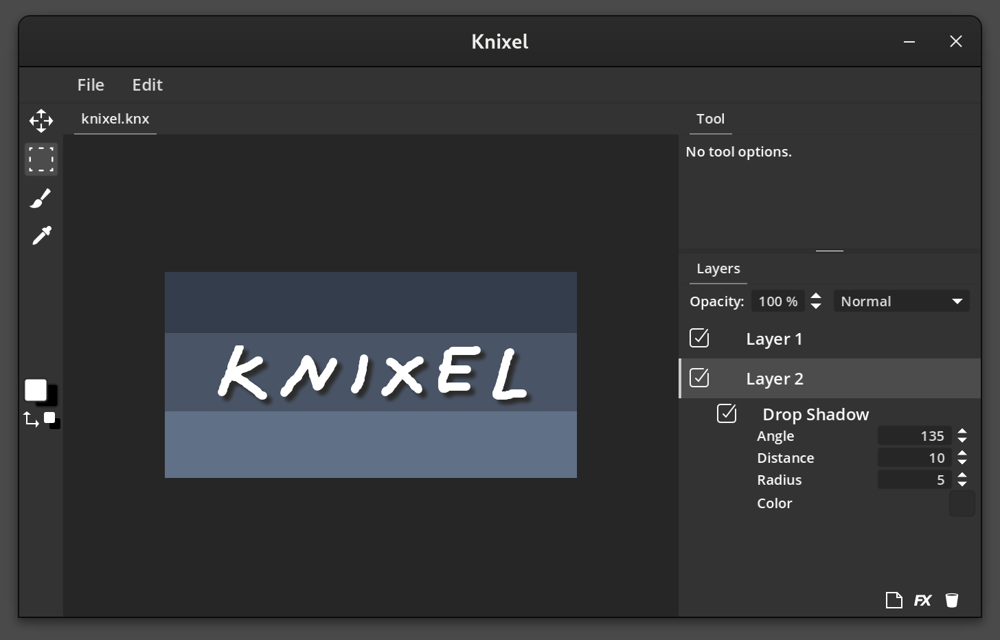

Knixel
=

Knixel is an image editor in early stages. It can currently load and save images and do some simple operations like basic painting and copy/pasting. It supports layers and layer effects, but all parts mostly have just basic "proof of concept" functionality.

Features
-
* Layers with opacity and blend modes
* Layer effects
* Selection with copy/paste as well as cut or clone dragging of selection.
* Load/save common image formats (PNG, JPG etc)
* Load/save Knixel documents.
* Full undo/redo
* GPU accelerated processing

Goals
-
The initial idea of Knixel was just to provide a simple tool for doing basic image operations like copy/pasting and moving things around in an image. A common personal use case would be to move things around in a screenshot to mock up UI concepts.

Now that the basic framework is in place I intend to flesh out some classic tools a bit more, and also explore some new concepts I would like to see in an image editor.

Development
-
Knixel is created using [Godot Engine](https://godotengine.org) 4.3 and is distributed under the MIT License.